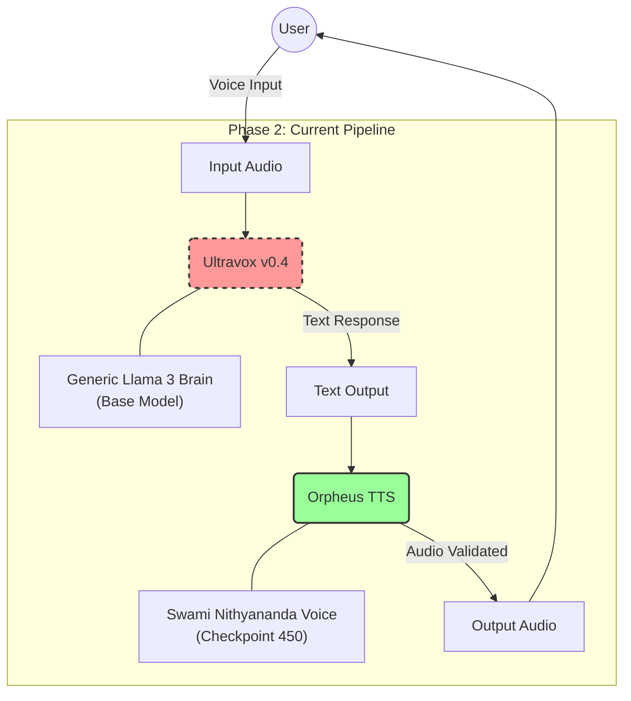
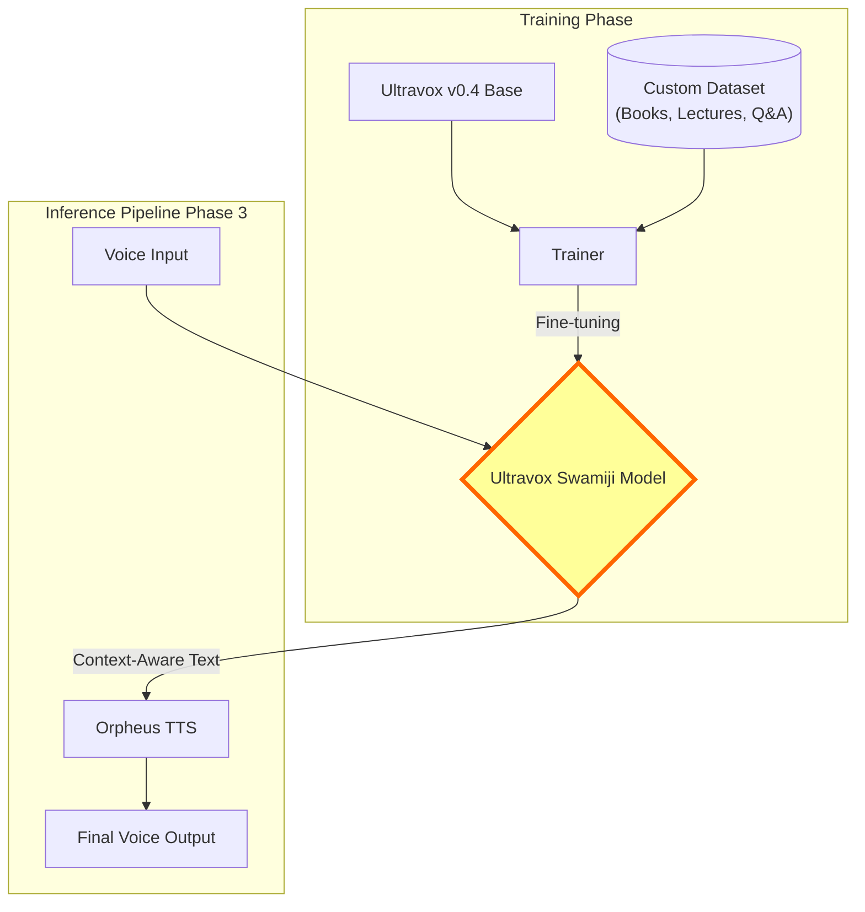

# System Architecture

## Current Verification State (Phase 2)
The current pipeline uses a modular approach where the "Brain" and "Voice" are separate.

### Verification Data
*   **Input**: `speech_pipeline/arjuna_krishna.wav` (Voice Note asking about Arjuna & Krishna)
*   **Ultravox Output**: "You're referring to the relationship between Arjuna and Lord Krishna."
*   **TTS Output**: `speech_pipeline/final_output_full.wav` (Generated Speech)

### System Diagram

## Phase 3: Integration Required
To achieve the full persona, the **Base Ultravox Model** must be replaced with a **Fine-tuned Version**.

### Integration Steps
1.  **Prepare Data**: Format existing transcripts into `(audio, text)` or `(text instruction, text response)` pairs appropriate for Ultravox training.
2.  **Fine-tune**: Run Ultravox training on the A6000 pod.
3.  **Plug-in**: Update `ultravox_handler.py` to point to the new `checkpoint` instead of `fixie-ai/ultravox-v0_4`.
