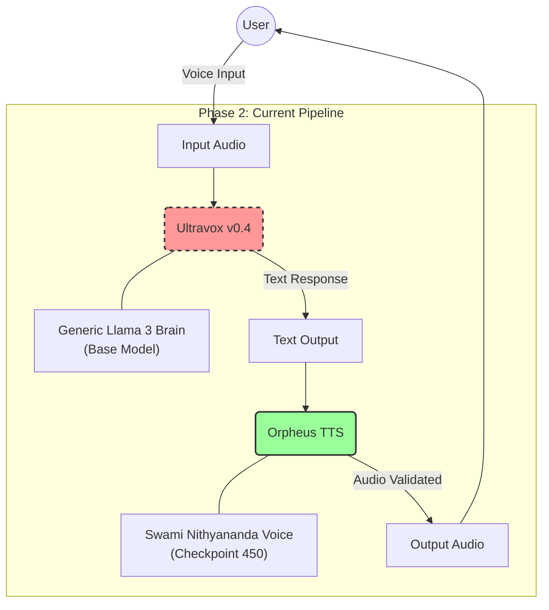
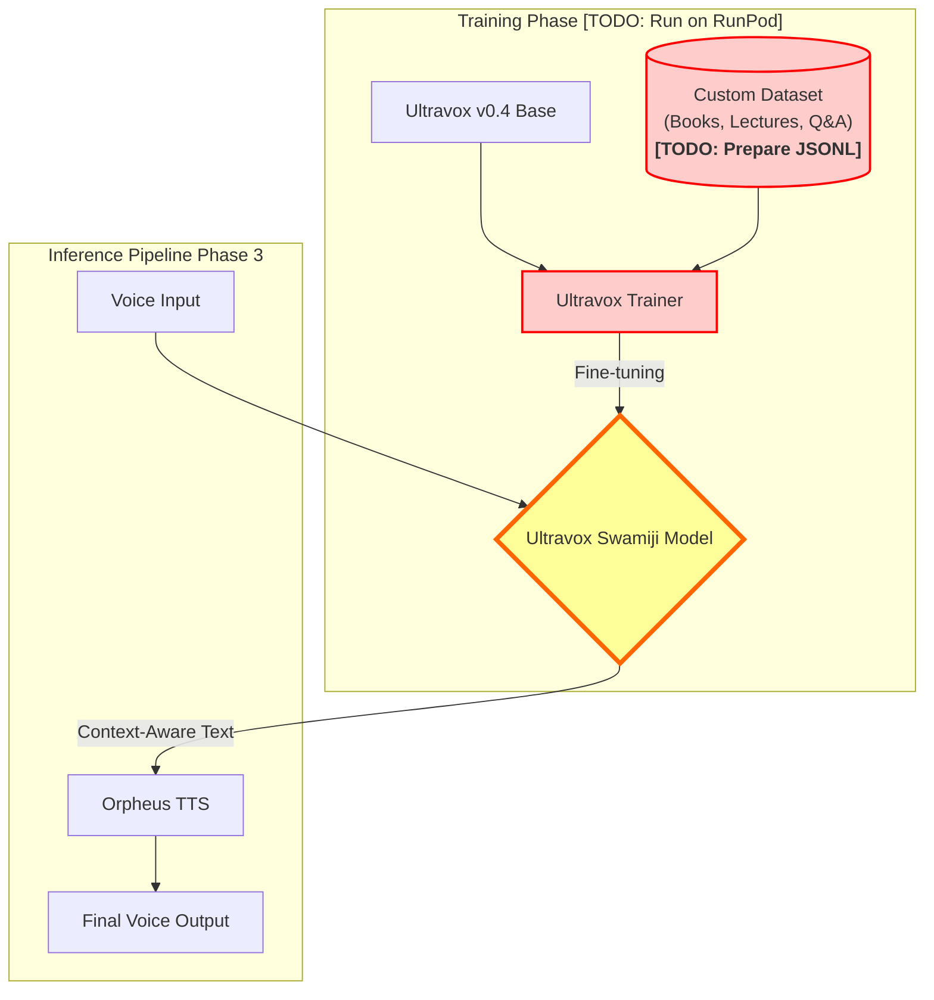

# System Architecture

## Current Verification State (Phase 2)
The current pipeline uses a modular approach where the "Brain" and "Voice" are separate.

### Verification Data
*   **Input**: `speech_pipeline/arjuna_krishna.wav` (Voice Note asking about Arjuna & Krishna)
*   **Ultravox Output**: "You're referring to the relationship between Arjuna and Lord Krishna."
*   **TTS Output**: `speech_pipeline/final_output_full.wav` (Generated Speech)

### System Diagram

## Phase 3: Integration Required
To achieve the full persona, we must execute the following **TODOs** to replace the Generic Brain.

### Integration Steps (Detailed)
1.  **[TODO] Data Prep**: Convert your corpus into Ultravox-compatible `jsonl` format containing `{"audio": ..., "text": ...}` (or text-only instruction tuning).
2.  **[TODO] Training**: Use the A6000 GPU to fine-tune `fixie-ai/ultravox-v0_4` on this dataset.
3.  **[TODO] Inference Switch**: Update `ultravox_handler.py` to point to the new local checkpoint.
